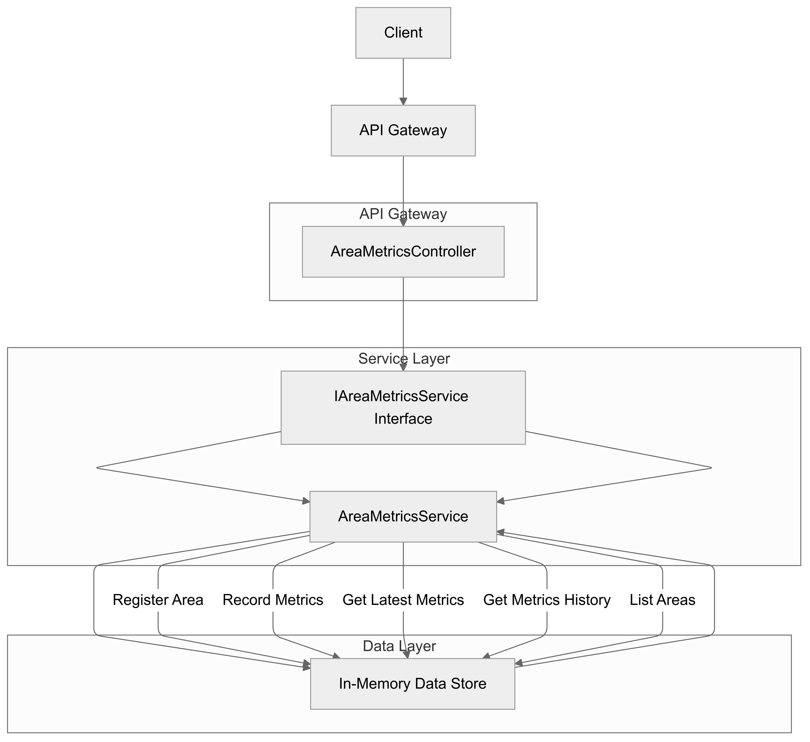

# Data Center Environmental Metrics Monitoring Application

This application is a microservice built using **ASP.NET Core Web API** to monitor and manage environmental metrics such as power usage, temperature, and humidity in different areas of a data center.

## Features
- Register new areas for monitoring.
- Record time-indexed environmental metrics (power usage, temperature, humidity) for specific areas.
- Retrieve the latest metrics or the full history of metrics for any area.
- List all monitored areas along with their latest metrics.

## Table of Contents
- [System Design](#system-design)
- [Technologies](#technologies)
- [Getting Started](#getting-started)
- [API Endpoints](#api-endpoints)
- [Future Enhancements](#future-enhancements)

## System Design

The application follows a microservice architecture with three key layers:
1. **API Layer**: Exposes RESTful endpoints via the `AreaMetricsController`.
2. **Service Layer**: Business logic is encapsulated in the `AreaMetricsService`, which implements the `IAreaMetricsService` interface.
3. **Data Layer**: Uses an in-memory data store (`Dictionary<Guid, AreaMetrics>`) to manage data temporarily.

For detailed system design, refer to the diagram:



## Technologies
- **ASP.NET Core Web API**
- **C#**
- **In-Memory Data Store** (can be replaced with a persistent database)
- **Dependency Injection**

## Getting Started

### Prerequisites
- [.NET SDK](https://dotnet.microsoft.com/download)

### Installation

1. Clone the repository:
    ```bash
    git clone https://github.com/your-username/data-center-metrics.git
    ```

2. Navigate into the project directory:
    ```bash
    cd data-center-metrics
    ```

3. Restore dependencies and build the project:
    ```bash
    dotnet restore
    dotnet build
    ```

4. Run the application:
    ```bash
    dotnet run
    ```

The application will be available at `https://localhost:5001` or `http://localhost:5000`.

## API Endpoints

### POST /api/areas
Register a new area for monitoring.
- **Request Body**: Area name as a string.
- **Response**: Returns the `Guid` of the newly registered area.

### POST /api/areas/{id}/metrics
Record metrics for a specific area.
- **Request Body**:
    ```json
    {
      "Timestamp": "2024-01-01T10:00:00",
      "PowerUsage": 100.5,
      "Temperature": 25.0,
      "Humidity": 40.0
    }
    ```
- **Response**: `200 OK`

### GET /api/areas/{id}/metrics/latest
Get the latest recorded metrics for an area.
- **Response**: Latest `MetricRecord` (timestamp, power usage, temperature, humidity).

### GET /api/areas/{id}/metrics/history
Retrieve the full history of metrics for an area.
- **Response**: List of `MetricRecord` objects.

### GET /api/areas
List all monitored areas along with their latest metrics.
- **Response**: List of `AreaMetrics` objects.

## Future Enhancements
- **Pagination** for metrics history to handle large datasets efficiently.
- **Time-Range Queries** for filtering metrics within a specific time range.
- **Persistent Storage** using a database such as SQL or NoSQL for long-term data retention.
- **Logging** for better observability and debugging.
- **Error Handling** for more robust and user-friendly responses.
